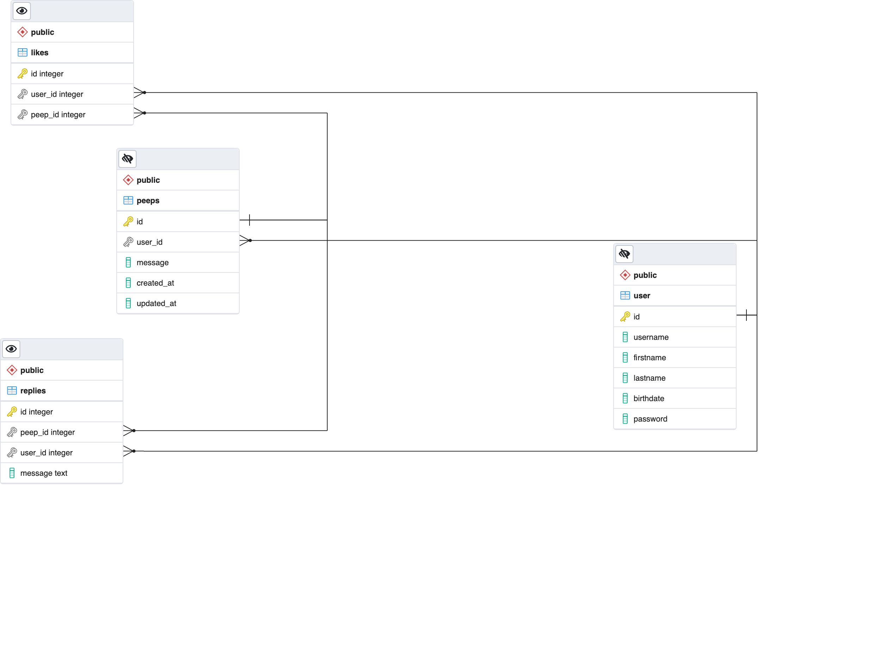
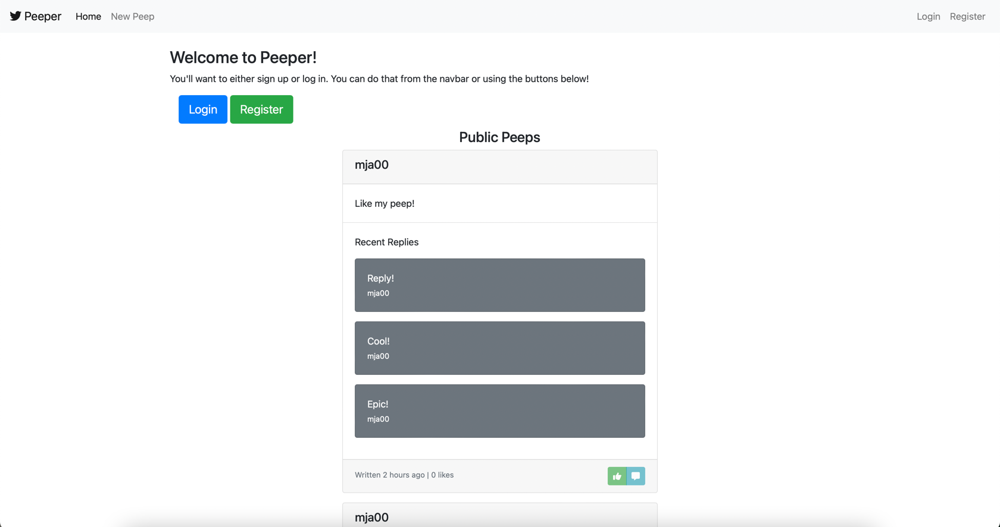
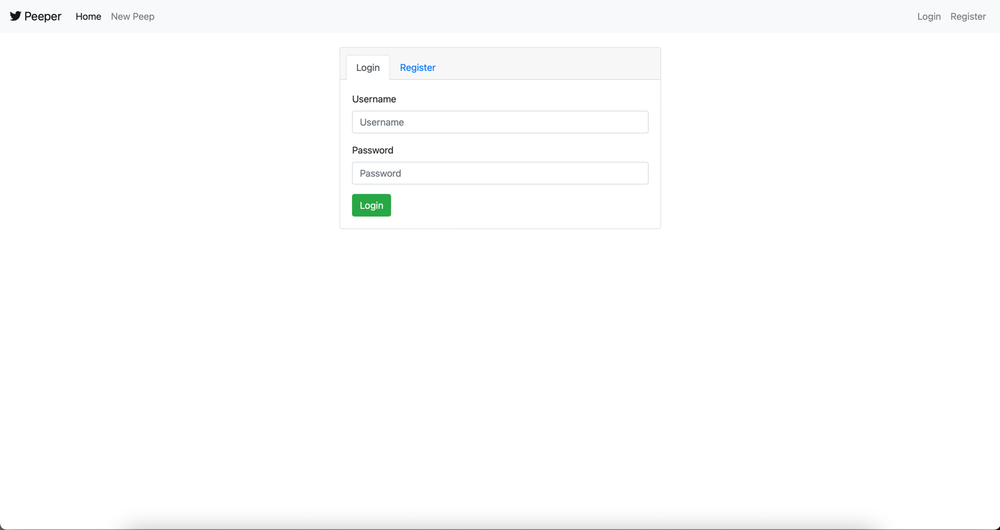
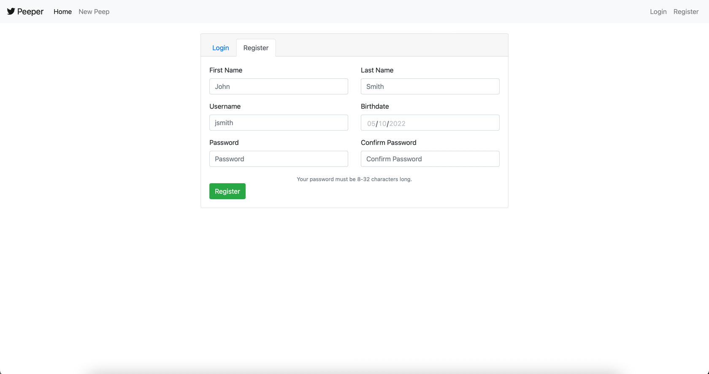
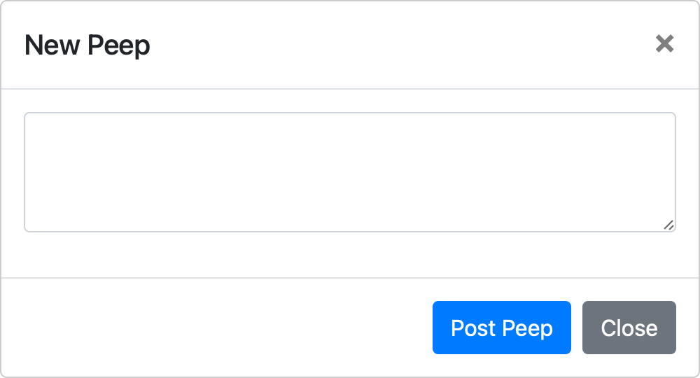
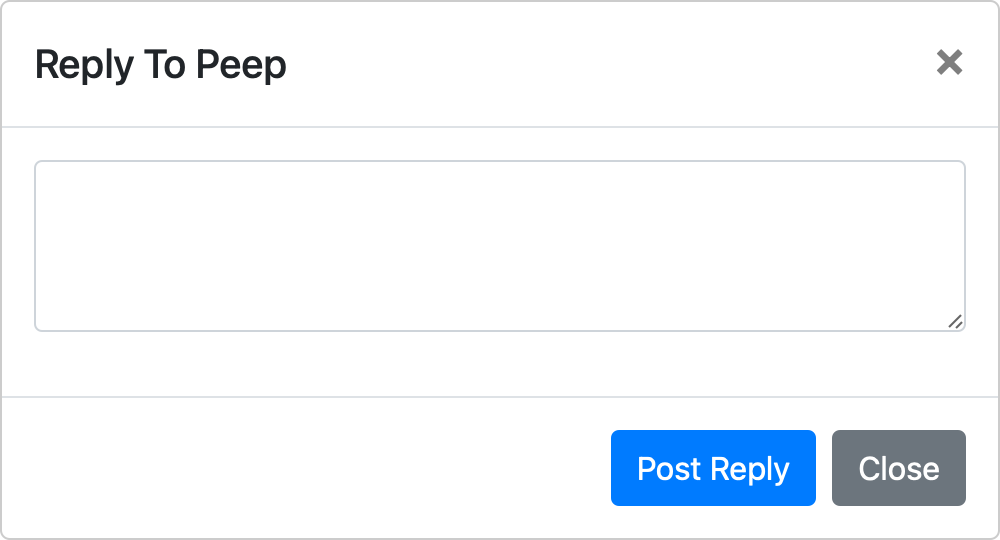

# Peeper

### Totally not like the *other* bird related social media platform.

## Table Of Contents
- [What is Peeper?](#what-is-peeper)
- [What isn't Peeper?](#what-isnt-peeper)
- [What is Peeper missing?](#what-is-peeper-missing)
- [What will Peeper have in the future?](#what-will-peeper-have-in-the-future)
- [Current Bugs and Issues](#current-bugs-and-issues)
- [Technologies Used](#technologies-used)
  - [Front-End](#front-end)
  - [Back-End](#back-end)
  - [Development Environment](#development-environment)
- [ERD Diagram](#erd-diagram)
  - [User Table](#user-table)
  - [Peep Table](#peep-table)
  - [Reply Table](#reply-table)
  - [Like Table](#like-table)
- [Installation](#installation)
- [Screenshots](#screenshots)

### What is Peeper?

Peeper is a social media platform written in JavaScript that allows you to create Peeps(posts), likes Peeps and reply to
them.
When a Peep is posted it's shown to all visitors of the website, sorted by newest Peep first.
Registered users can then like and/or reply to Peeps.

### What isn't Peeper?

Peeper is **not** a replacement for your favorite social media platform.
For one, it's missing a lot of the features that your favorite platform has.
However, you can still use it to post your favorite text based memes.

### What is Peeper missing?

Peeper is missing the following features:

- Image based Peeps
- Peeps with a link
- Peeps with a video
- Peeps with a quote
- Peeps with a code block
- Replies containing any of the above
- Peeps with a poll
- Profiles
- Notifications
- Search
- ...and more!

### What will Peeper have in the future?

Peeper will have the following features in the immediate future:

- Image based Peeps
- Peeps with a link
- Peeps with a video

---

## Current Bugs and Issues

- There is no security whatsoever.
- There is no front-end way to delete Peeps or replies.
- There is no way to edit Peeps or replies.
- Every so often the database will fail to return anything.

---

## Technologies Used

### Front-end

- [EJS](https://ejs.co/)
- [jQuery](https://jquery.com/)
- [Bootstrap](https://getbootstrap.com/)
- [Font Awesome](https://fontawesome.com/)

### Back-end

- [Node.js](https://nodejs.org/)
- [Express.js](https://expressjs.com/)
- [PostgreSQL](https://www.postgresql.org/)
- [Express Sessions](https://www.npmjs.com/package/express-session)
- [Connect-Flash](https://www.npmjs.com/package/connect-flash)
- [nodemon](https://www.npmjs.com/package/nodemon)
- [cookie-parser](https://www.npmjs.com/package/cookie-parser)

### Development Environment

- [JetBrains WebStorm](https://www.jetbrains.com/webstorm/)
- [Postman](https://www.getpostman.com/)
- [Chrome DevTools](https://www.google.com/chrome/devtools/)
- [pgAdmin 4](https://www.pgadmin.org/)
- [GitHub](https://www.github.com)

---

## ERD Diagram

### User Table

This table contains all the users that have registered with Peeper.

| Column    | Type         | Description       |
|-----------|--------------|-------------------|
| id        | integer      | Primary Key       |
| username  | varchar(255) | Username          |
| password  | varchar(255) | Password          |
| firstname | varchar(255) | User's first name |
| lastname  | varchar(255) | User's last name  |
| birthdate | varchar(255) | User's birthdate  |

### Peep Table

This table contains all the Peeps that have been posted.

| Column     | Type      | Description                     |
|------------|-----------|---------------------------------|
| id         | integer   | Primary Key                     |
| user_id    | integer   | Foreign Key                     |
| message    | text      | The message in the Peep         |
| created_at | timestamp | The time the Peep was created   |
| updated_at | timestamp | The time the Peep was updated   |

### Reply Table

This table contains all the replies to Peeps. This is a one-to-many relationship.
With one row being a single reply to a single Peep.

| Column     | Type    | Description                     |
|------------|---------|---------------------------------|
| id         | integer | Primary Key                     |
| peep_id    | integer | Foreign Key                     |
| user_id    | integer | Foreign Key                     |
| message    | text    | The message in the reply        |

### Like Table

This table contains all the likes to Peeps. This is a one-to-many relationship.
With one row being a single like to a single Peep.

| Column     | Type         | Description                     |
|------------|--------------|---------------------------------|
| id         | integer      | Primary Key                     |
| peep_id    | integer      | Foreign Key                     |
| user_id    | integer      | Foreign Key                     |

--- 

## Installation

---

## Screenshots

